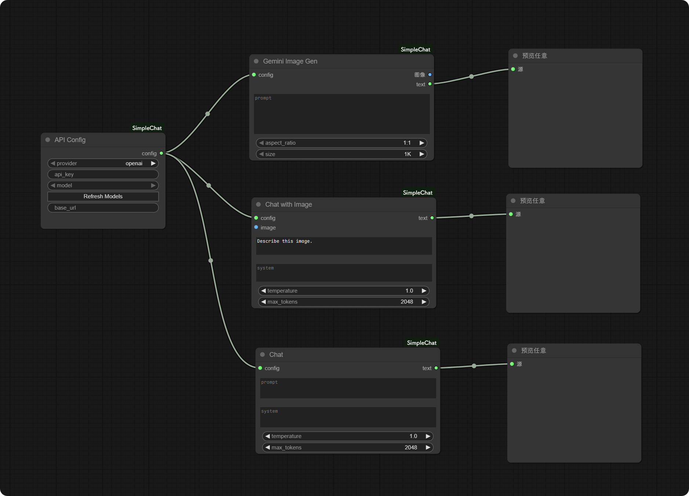

# ComfyUI-SimpleChat

ComfyUI 的极简 LLM 聊天节点。轻松连接 OpenAI, Claude, Gemini 以及本地 LLM。

[English](README.md) | [中文](README_CN.md)



[查看示例工作流 JSON](assets/SimpleChatExample.json)
  
- **画师批量测试（网格）示例工作流**：`assets/ArtistBatchTest_Grid.json`
- **画师×背景 XY Plot（带标签）示例工作流**：`assets/ArtistXYPlot_Test.json`
- **画师×画师叠加 XY Plot（对角线单画师 / 非对角线为 X+Y）示例工作流**：`assets/ArtistBlendXYPlot_Test.json`

## 特性 (Features)

- **一站式配置**: 一个强大的配置节点即可搞定所有提供商。
- **动态获取模型**: 点击按钮即可获取您的 API Key 实际可用的**实时模型列表**。告别写死的列表！
- **通用兼容性**: 支持官方 API 以及任何兼容 OpenAI 格式的代理/本地接口 (如 LM Studio, Ollama)。
- **多模态支持**: 使用具备视觉能力的模型与图片进行对话。
- **NoASS 角色扮演模式 (实验性)**: 专为硬核角色扮演设计的节点，支持 Assistant Prefill (预填) 技术。
- **Gemini 原生功能**: 专为 Gemini 设计的文生图和图片编辑节点。
- **模板变量 (Mustache)**: 在 prompt/system 等任意文本里写 `{{变量名}}`，通过节点统一注入替换。
- **JSON 解析拆字段**: 将 JSON 自动解析并按 path 输出到多个端口（固定 8 路）。
- **JSON Parse (16)**: 同上，但固定 16 路输出端口（更适合你“分段多、端口多”的场景）。
- **JSON -> Vars (Editable)**: 任意 JSON 一键转胡子变量（可选扁平化 `a.b.c`），支持 `vars_in`/手动 overrides 覆盖。
- **Anima Prompt Router（可编辑 + 锁定）**: LLM 输出一个 JSON → 自动拆成分段字段（画师/风格/背景等）→ 支持手动覆盖输入 + 锁定锁存（新 JSON 来了也不改）。
- **批量测试小工具**: `Text List (Batch)` 生成字符串列表驱动批次跑图；`Image Grid (Batch)` 把批次图片拼成表格网格图。
- **XY Plot（完整表格）**: `Anima XY Matrix (JSON List)` 生成交叉组合 → `XY Plot (Labels)` 输出带 X/Y 标签的“完整 XY 表格图”。
- **Markdown 渲染预览**: 将文本以 Markdown 方式弹窗渲染展示（已做净化，避免脚本注入）。

## Wiki（GitHub 原生）

- **Wiki 首页**：`https://github.com/Moeblack/ComfyUI-SimpleChat/wiki`
- **仓库内维护源**：`docs/wiki/`（由 GitHub Actions 自动同步发布）
- **注意**：需要在 GitHub 仓库 Settings -> Features -> 勾选 Wiki

## 安装 (Installation)

1. 进入您的 `ComfyUI/custom_nodes` 文件夹并克隆本仓库：
```bash
git clone https://github.com/Moeblack/ComfyUI-SimpleChat.git
```
2. 重启 ComfyUI。

## 使用指南 (Usage Guide)

### 1. API 配置 (核心步骤)

一切从 **API Config** 节点开始。

1.  **添加节点**: 右键 -> `SimpleChat` -> `API Config`。
2.  **选择提供商 (Provider)**: 选择 `openai`, `claude`, 或 `gemini`。
3.  **输入 API Key**: 粘贴您的密钥。
    *   *OpenAI*: `sk-...`
    *   *Claude*: `sk-ant-...`
    *   *Gemini*: 您的 Google AI Studio key。
4.  **Base URL (可选)**:
    *   **强烈建议留空**，除非您使用代理或本地模型。
    *   插件内置了默认的官方 API 地址：
        *   OpenAI: `https://api.openai.com/v1`
        *   Claude: `https://api.anthropic.com/v1`
        *   Gemini: `https://generativelanguage.googleapis.com/v1beta`
    *   如果您使用中转服务（如 DeepSeek, OneAPI 等），通常需要填写包含 `/v1` 的完整路径，例如 `https://api.deepseek.com/v1`。
5.  **选择模型 (Select Model)**:
    *   **点击 "Refresh Models" 按钮**。
    *   节点会连接 API 并获取您当前可用的**实时模型列表**。
    *   从下拉菜单中选择您想用的模型。

### 2. 基础对话 (Basic Chat)
用于标准的文本生成或问答。

*   **节点**: `Chat`
*   **连接**: 将 **API Config** 的 `config` 输出连接到 **Chat** 的 `config` 输入。
*   **输入**: 在 `text` 中输入您的提示词。
*   **输出**: 返回 AI 的回复字符串。
*   **模板变量（可选）**: 将 `Mustache Var` 的 `vars` 输出接到 `Chat` 的 `vars` 输入后，`prompt/system` 中支持写 `{{变量名}}` 并自动替换。

### 3. 图片对话 (Chat with Images)
让 AI 分析或描述图片。

*   **节点**: `Chat with Image`
*   **连接**:
    *   连接 **API Config** 的 `config`。
    *   连接一张图片 (来自 `Load Image` 节点) 到 `image` 输入。
*   **输入**: 输入提示词 (例如："描述这张图片")。

### 4. NoASS 角色扮演 (Chat NoASS - Experimental)
"No Assistant" (NoASS) 节点专为**硬核角色扮演和创意写作**设计。它利用 Assistant Prefill 技术，强行规定 AI 回复的开头，从而打破角色的废话限制。

*   **节点**: `Chat NoASS (Exp)`
*   **输入**:
    *   **Scenario Instructions (场景指令)**: (对应 User 消息) 定义世界观、角色设定和规则。这是舞台背景。
    *   **User Action (用户动作)**: 您当前轮次的动作或对话。
    *   **Prefill Start (预填开头 - 可选)**: 强行写下 AI 回复的前几个字。AI **必须**接着这几个字往下写。这是控制语气和破除限制的神器。
    *   **History (历史)**: 将输出的 `history` 连接到下一个节点的 `history` 输入，以保持对话连续性。

### 5. Gemini 文生图 (Gemini Image Generation)
使用 Google Gemini 模型生成图片。

*   **节点**: `Gemini Image Gen`
*   **要求**: **API Config** 中必须选择 `gemini` 提供商。
*   **输出**: 生成标准的 ComfyUI IMAGE。

### 6. Gemini 图片编辑 (Gemini Image Edit)
通过文字指令修改现有图片。

*   **节点**: `Gemini Image Edit`
*   **输入**: 原图 (Source image) + 遮罩 (Mask image) + 提示词 (Prompt)。

### 7. JSON 解析拆字段 (JSON Parse)
把 LLM 输出的 JSON 自动解析成多个字段，便于接入后续节点。

*   **节点**: `JSON Parse`
*   **输入**:
    *   `json_text`: JSON 字符串（支持从 ```json ... ``` 代码块中自动提取）
    *   `path1..path8`: 取值路径（支持 `a.b.c` 与 `items[0].name`）
*   **输出**: `out1..out8` + `obj`（完整解析后的对象）

### 7.0 JSON Parse (16)
如果你希望“默认更多端口”（例如 16 段），用这个节点。

*   **节点**: `JSON Parse (16)`
*   **输入/输出**：和 `JSON Parse` 一样，只是 `path1..path16` / `out1..out16`

### 7.1 Prompt JSON 拆包（强烈推荐）
如果你的 LLM 输出遵循固定 JSON 格式（positive/negative/width/height/steps/cfg/sampler/seed/notes），推荐用这个节点“一键拆包”，并且 **width/height/steps/cfg/seed/sampler 都是带类型输出**，可直接接到 ComfyUI 的对应输入口（不用手动填 path，也不用字符串转数字）。

*   **节点**: `Prompt JSON Unpack`
*   **输入**: `json_text`（支持从 ```json ... ``` 代码块中自动提取）
*   **输出**:
    *   `positive` / `negative`（STRING）
    *   `width` / `height` / `steps` / `seed`（INT）
    *   `cfg`（FLOAT）
    *   `sampler`（SAMPLER）
    *   `notes`（STRING）
    *   `vars`（SIMPLECHAT_VARS：自动把这些字段映射成 `{{positive}}`/`{{width}}` 等胡子变量，另含中文别名）

### 7.2 Anima Prompt Router（可编辑 + 锁定）
如果你希望把提示词拆成「画师 / 风格 / 背景 / 通用标签 / 负面」等分段来管理，但又不想每次都复制粘贴到一堆节点，这个节点就是用来**自动拆分 + 可手动改 + 可锁定**的。

*   **节点**: `Anima Prompt Router (Editable)`
*   **输入**:
    *   `json_text`: LLM 输出的 JSON（支持 ```json ... ``` 代码块）
    *   `override_*`: 你想主动修改的字段（填了就覆盖 JSON）
    *   `lock_*`: 锁定某字段（锁定后，新 JSON 来了也不会改，会保持上一次值；你仍可用 override 主动改）
    *   `reset_latches`: 清空所有锁存值
*   **输出**:
    *   分段字段：`quality_meta_year_safe / count / character / series / artist / style / environment / tags / neg`
    *   自动重组：`positive / negative`
    *   `vars`: 可直接用于 Mustache（含 `{{anima.artist}}`、`{{画师}}` 等别名）
    *   `json_text`: 输出“修改后的 JSON”（可再接到 `Prompt JSON Unpack` 继续拆参数）

### 7.3 JSON -> Vars (Editable)（任意 JSON 变胡子变量）
当你已经有一个 JSON（不一定是 Anima schema），但想直接在别的节点里用 `{{key}}` 引用它：

*   **节点**: `JSON -> Vars (Editable)`
*   **输入**:
    *   `json_text`: 任意 JSON
    *   `flatten_keys`: 是否把嵌套字段展开为 `a.b.c` / `arr[0]` 这种键
    *   `prefix`: 可选前缀，例如填 `anima` 会同时生成 `anima.xxx`
    *   `overrides`: 允许写 `key=value` 覆盖（支持多行）
    *   `vars_in`: 可选，允许你把外部 vars 合并进来
*   **输出**: `vars`（可直接接到 SimpleChat 节点的 `vars` 输入）

### 9.0 XY Plot：画师 × 背景（完整表格）
如果你要“真正的 XY Plot（有行列标签）”，推荐：

1) `Anima XY Matrix (JSON List)`：输入 base JSON + X 列表（画师）+ Y 列表（背景/风格等）→ 输出 JSON 列表 + `columns/x_labels/y_labels`
2) 下游照常跑图（`Prompt JSON Unpack` → CLIP/KSampler → VAE Decode）
3) `XY Plot (Labels)`：把 batch 图 + `columns/x_labels/y_labels` 输入，输出一张带标签的完整 XY 表格图

#### 9.1 画师×画师叠加（对角线单画师）
如果你想做“横轴画师、纵轴画师”的叠加测试：

- 把 `x_field` 和 `y_field` 都选 `artist`
- `y_list` 留空，并勾选 `auto_y_from_x_when_empty`
- `same_field_behavior` 选 `combine`
- `pair_join` 选 `newline`（实现你说的“X 换行 Y”）
- 勾选 `diagonal_single`（对角线单画师）

### 8. Markdown 渲染预览 (Markdown Preview)
把文本以 Markdown 渲染的方式展示（弹窗），适合预览 LLM 的结构化输出/说明文档。

*   **节点**: `Markdown Preview`
*   **用法**: 把任意文本输出接到 `text`，执行后自动弹窗渲染。

### 9. 批量测试：画师表格（Text List + Router + Image Grid）
想做“尽可能多画师的对比表格”，推荐这条最短链路（不依赖臃肿大包）：

1) `Text List (Batch)`：把画师列表按行贴进去（每行一个 `@artist`）
2) `Anima Prompt Router (Editable)`：把 `Text List.item` 接到 `override_artist`，并勾选 `lock_*` 把主体/风格/背景等固定住
3) 把 Router 的 `positive/negative` 接到你的出图工作流（CLIP/KSampler）
4) 最后把出图得到的 batch 接到 `Image Grid (Batch)` 拼成表格图

### 10. Anima 提示词模板（文档）
如果你用 SimpleChat 让 LLM 帮你写 Anima 的提示词，推荐直接用这份 System Prompt：

*   `docs/anima_prompt.md`
*   `docs/anima_scheme.md`（JSON 字段 + 内置胡子变量命名方案）

（可选）示例工作流：
*   `assets/AnimaPromptScheme.json`

## 常见问题 (FAQ)

**Q: 列表里找不到我要的模型。**
A: 请确保 API Key 和 Base URL 输入正确，然后点击 **Refresh Models**。只要 API 支持列出模型，它们就会显示出来。如果不支持，您可以尝试直接在下拉框中手动输入模型名称（如果 UI 允许）或检查服务商文档。

**Q: 我可以用本地模型吗？**
A: 可以！提供商选择 `openai`，将 **Base URL** 设置为您本地服务的地址 (例如 `http://127.0.0.1:1234/v1`)，然后点击 Refresh。

**Q: 下拉框是空的。**
A: 请检查网络连接和 API Key。如果 API Key 无效或网络不通，列表将无法填充。

## 许可证 (License)

MIT
